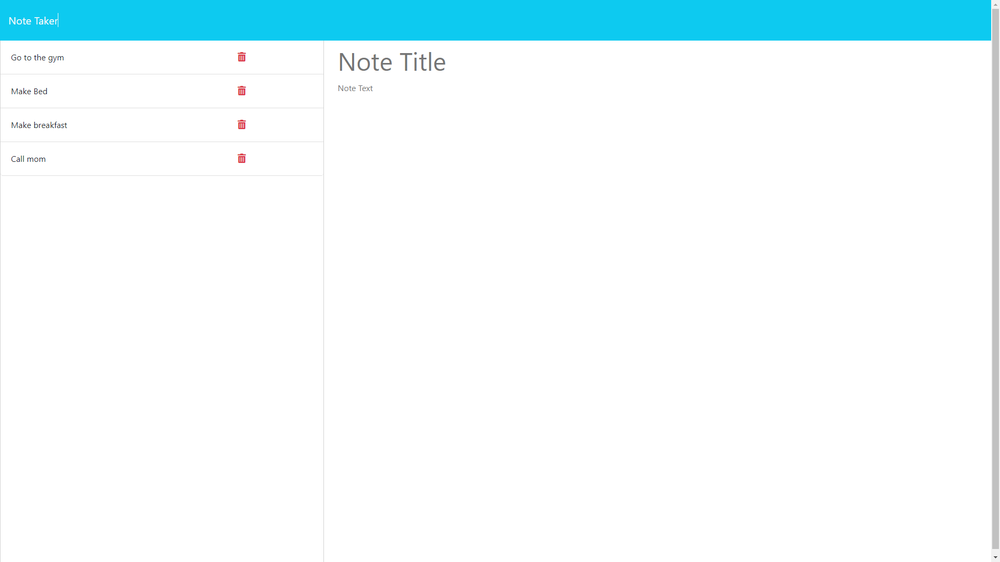
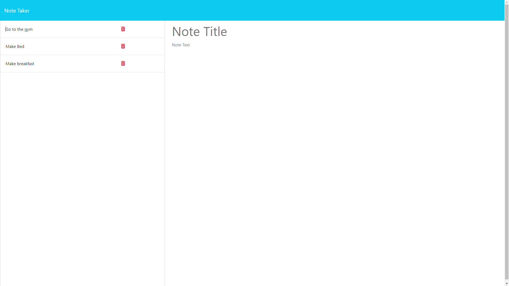

# Jot-It-NOW
 
## Description
A smart note taking application designed for all memos. Just jot it down with Jot-It-NOW!

## Installation Requirements
This application requires node.js and express. 

## Usage
Launch the app with from the html and simply record notes. Label the notes with a title and then a brief description of the note. Post as many notes as you like and access them from the left side of the webpage. Delete notes by clicking on the trash can icon. 

### Link to deployed application
https://secure-forest-90672-7b0c1bbea82e.herokuapp.com/

### Screenshots
,
